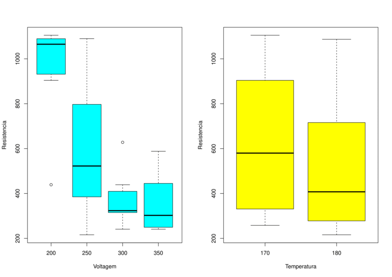
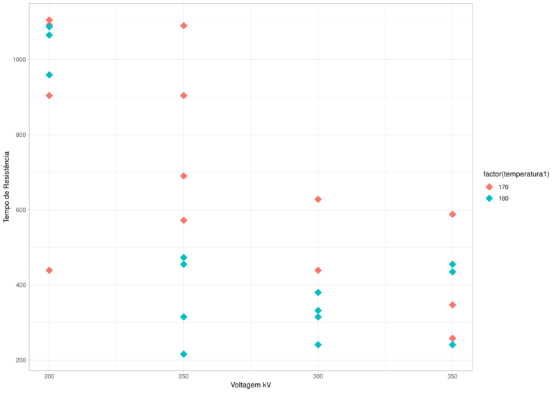
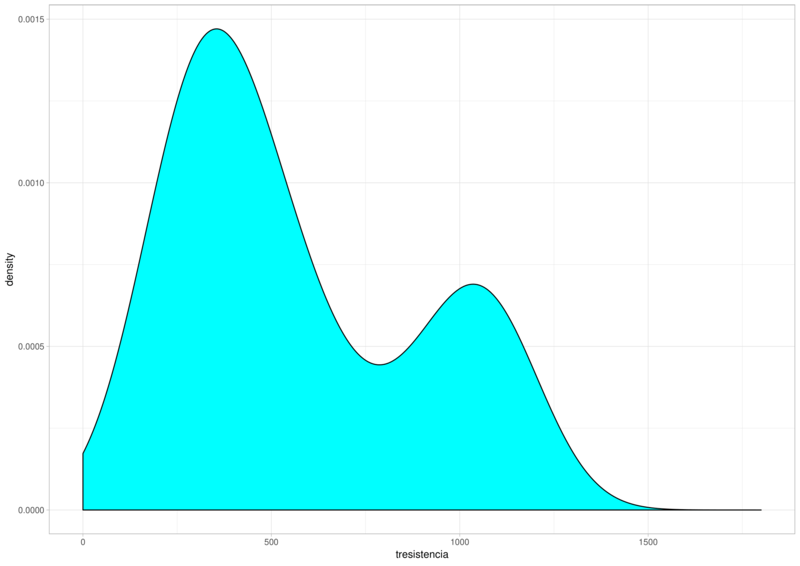
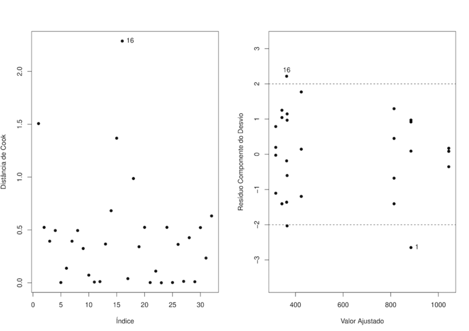

Relatório do Livro de Gilberto a Paula Questão 7
=====
Na minha graduação fiz vários relatórios, em diversas disciplinas. Aqui, irei apresentar um resumo de um desses relatórios.

Introdução
==========

O objetivo desse trabalho é saber de que forma os níveis de voltagem e temperatura afetam o tempo médio de resistência dos vidros.

Primeiramente foi feito uma análise descritiva dos dados, mostrando a influencia dos dados sobre a variável resposta. E logo após, o ajuste do modelo para mostrar que as variáveis voltagem e temperatura interferem na resistência dos vidros.

Análise de Dados
================

Nas tabelas abaixos são apresentados os resultados de um experimento, em que a resistência (em horas) de um determinado tipo de vidro, foi avaliada segundo quatro níveis de voltagem (em kilovolts) e duas temperaturas (em
graus Celsius).


        Voltagens com temperatura  de 170c        
  
  200kV  |    250kV |  300kV    |   350kV 
  :------: |:----------:|:---------:  | :-----:
  439h   |  572h    |   315h   |258h
  904h   |   690h   |    315h  | 258h
  1092h  |   904h   |    439h  | 347h
  1105h  |   1090h  |    628h  | 588h


        Voltagens com temperatura  de 180c  
     
  
  200kV  |  250kV  |   300kV  | 350kV
  :-------:  | :---------: | :----------: | :--------:
  959h  |    216h |    241h  | 241h
  1065h |    315h |    315h  | 241h
  1065h |    455h |    332h  | 435h
  1087h |    473h |    380h  | 455h


Análise Descritiva
------------------

Na tabela abaixo são apresentadas as médias, desvios e coeficiente de variação das variáveis Resistência, voltagem e temperatura. Podemos perceber que a resistência média foi de 569,34 ao passo que a voltagem
e a temperatura apresentaram médias iguais a 275 e 175, respectivamente. O coeficiente de variação da resistência é próximo de 56%, indicando assim, uma alta dispersão nos dados.

|       | Resistência  |  Voltagem  | Temperatura |
|-------|:--------------:|:-----------: | :------------:|
|Média  |569,34        |  275       |  175        |
|Desvio |316,98        | 56,80      |  5,08       |
|CV     |55,67%        |  20,65 %   |  2.90 %     |

Nas tabelas abaixo, fixando cada uma das co-variáveis, nota-se valores maiores para a resistência média com a menor temperatura (170c) e menor voltagem (200kV). Todavia, o coeficiente de variação apesar de diminuir quando fixa-se as co-variáveis, apresenta uma dispersão média dos dados.


    Resistencia fixando a temperatura:

  
  |     |Resistência à 170c | Resistência à 180c |
  |:-----:|:-------------------:|:--------------------:|
  |Média |        621,50    |               517,19|
  |Desvio|        309,47    |               325,67|
  |CV     |       49,80%    |               62,97%|

    Resistencia fixando as voltagens:

  
 |    |Resistência à 200kv |  Resistência à 250kv|  Resistência à 300kv|  Resistência à 350kv|
 |:------:|:---------------:|:---------------:|:------------:|:--------:|
  |  Média  |   964,50   |  589,38  |      370,63   |  352,88
  |  Desvio |   223,94   |  294,31   |     118,67   |   128,47
  |  CV     |   23,21%  |   49,93%  |      32,01%   |   36,40%


Percebe-se que as maiores médias da resistência, foram com
menor voltagem 200kv e temperatura 170c.

É possível ver também esses dois fatores acontecendo no gráfico abaixo.




Nota-se duas observações discrepantes nos dados, uma com voltagem a 200kV e a outra a 300kV.

Ainda é possível ver a voltagem e temperatura interagindo sobre a resistência do vidro. Como é mostrado no gráfico abaixo 



Ainda, podemos fixar as duas variáveis voltagem e temperatura e ver as estatísticas descritivas para cada uma delas.


 |    |Resistência à 200kv e 170c |  Resistência à 250kv e 170c|  Resistência à 300kv e 170c|  Resistência à 350kv e 170c|
 |:------:|:---------------:|:---------------:|:------------:|:--------:|
  |  Média  |   885,00   |  814,00  |    424,25     |  362,75
  |  Desvio |   311,20   |  229,65  |   158,88      | 155,92|
  |  CV     |   35,16 %  |28,21%    |34,85%         |42,98 %

    ----------------------------------------------------------------------- 

 |    |Resistência à 200kv e 180c |  Resistência à 250kv e 180c|  Resistência à 300kv e 180c|  Resistência à 350kv e 180c|
 |:------:|:---------------:|:---------------:|:------------:|:--------:|
  |  Média  |  1,04     |364,75   |317,00     |343,00
  |  Desvio |  5,76     | 121,74  |57,66      |118,06
  |  CV     |  5,52%    |33,38%   |18,19%     |34,42%


O mesmo acontece com a análise anterior, a maior média da resistência se
da pela temperatura a 170c e voltagem 200kV, sendo ela 885,00.

Já no gráfico de interação, indica-se uma redução da resistência média à medida que aumenta o nível de voltagem. Além disso, há indicação de interação entre voltagem e temperatura.


Ajuste do Modelo
----------------

Para fazer o ajuste do modelo precisamos saber qual distribuição melhor
se encaixa com os dados. Para isso o gráfico abaixo mostra se
existe algum tipo de simetria.



Como o interesse principal desse estudo é comparar as resistências
médias, é usual neste tipo de estudo, assumir respostas com alguma distribuição assimétrica. Isso foi comprovado na figura acima, que mostrou possuir assimetria a esquerda. Assim, vamos propor que a variável resposta tenha distribuição gama.

Foram considerado dois ajustes, sem e com interação da voltagem e temperatura.

Na tabela abaixo são apresentados as estimativas do ajuste sem a
interação. Todas as estimativas foram bastante significativas.


|              |Estimativas    |  P-valor |
|:--------------:|:--------------:|:------------:|
| Intercepto   |   1039,94     |  0.00      |
| voltagem2    |   -426,49     |  0.00      |
|  voltagem3   |    -608,81    |   0.00     |
|  voltagem4   |    -612,89    |   0.00     |
| temperatura2 |    -117,78    |   0.05     |
| phi          |   9.49 (2,33) |     -      |

No ajuste com interação, algumas variáveis da interação foram significativas a 5\%.


|                                      |  Estimativas  |  P-valor  |
|:--------------------------------------:| :--------------:|:-----------:|
| Intercepto                               | 885,00        | 0,00
| Voltagem (250kV)                         |  -71,00       |  0,71
| Voltagem (300kV)                         | -460,75       |  0,01
| Voltagem (350kV)                         | -522,25       |  0,00
| Temperatura (180c)                       | 159,00        | 0,46
| Voltagem (250kV) : Temperatura (180c)    | -608,25       |  0,03
| Voltagem (300kV) : Temperatura (180c)    | -266,25       |  0,26
| Voltagem (350kV) : Temperatura (180c)    | -178,75       |  0,44
|phi                                       | 13,35 (3,30)  |    -

Para decidir qual ajuste usar, foi feito um teste F utilizando os dois
ajustes. As hipóteses do teste F são: 

H0: Teste sem interação;

H1: Teste com interação


As estimativas do teste F foram:


   | Teste F   | P-valor  |
   |:-----:|:----------:|
   | 3.45|  0.0325  |

No qual, foi mostrado que o ajuste com interação é mais apropriado ao
nível de significância a 5\%. Porém a 1\% o mesmo deixa de ser
significativo, nos mostrando que não a diferença de escolha.

Inicialmente foi feito uma seleção de variáveis através do método
AKAIKE. Contudo, nenhuma variável deixou de ser significativa, nos
mostrando que a resistência depende da voltagem e temperatura.

Na Figura abaixo são apresentados alguns gráficos de diagnóstico, notamos uma discrepância da observação 16, que aparece
como ponto influente e aberrante. Além disso, notamos indícios de
heteroscedasticidade, ou seja, uma diminuição da variabilidade com o
aumento do valor ajustado. Assim, podemos propor um modelo alternativo,
que ajuste melhor a variância que o modelo Gamma.

 

A eliminação desses pontos muda as estimativas, embora não mude a
inferência. As novas estimativas são:


|         |Estimativas sem a obs. 1|Estimativas sem a obs. 16 |Estimativas sem as obs. 1 e 16 |
|:--------:|:------------:|:-------------:|:----------:|
|Intercepto  |                  1033,67  |       885,00  |      1033,67|
|Voltagem (250kV)  |               -219,67   |      -71,00  |      -219,67|
|Voltagem (300kV)      |            -609,42     |    -460,80    |     -609,42| 
|Voltagem (350kV)      |            -670,92  |       -597,30     |    -746,00| 
|Temperatura (180c)   |               10,33    |       159,00  |        10,33| 
|Voltagem (250kV) e Temperatura (180c)   |    -459,58   |      -608,20   |      -459,58| 
|Voltagem (300kV) e Temperatura (180c) |      -117,58   |      -266,20   |      -117,58| 
|Voltagem (350kV) e Temperatura (180c)  |     -30,08    |      -103,70   |       45,00| 
|phi           |      16,00 (4,023)  |  15,65 (3,93) |   19,75 (5,06) | 

Ao verificar o impacto que houve na retirada dessas obs. Temos :

|         |Impacto sem a obs. 1|Impacto sem a obs. 16 |Impacto sem as obs.1 e 16 |
|:--------:|:------------:|:-------------:|:----------:|
 | Intercepto           |        -16,80       | 0,00       | -16,80|
 | Voltagem (250kV)     |          -209,39    |    0,00    |   -209,39|
 | Voltagem (300kV)     |           -32,27    |    0,00    |    -32,27|
 | Voltagem (350kV)     |           -28,47    |   -14,38   |    -42,84|
 | Temperatura (180c)   |            93,50    |     0,00   |     93,50|
 | Voltagem (250kV) : Temperatura (180c)  |   24,44    |     0,00     |   24,44|
  Voltagem (300kV) : Temperatura (180c)   |  55,84   |      0,00      |  55,84|
  Voltagem (350kV) : Temperatura (180c) |     83,17     |   42,01   |    125,18|

O impacto é bastante alto, dado que o valor esperado para a retirada das
duas observações seria de 6,25. Isso acontece pois a adequação do
modelo e a existência de observações atípicas estão influenciando
diretamente no ajuste. Essa adequação pode ser vista na figura
abaixo


Não observamos pontos muito fora do envelope, porém observamos pontos
muito fora do alinhamento. Por conseguinte, há indicação de observações
atípicas, e que o modelo seja inadequado.

Conclusão
=========

O que foi visto na análise descritiva se refletiu no ajuste do modelo,
as variáveis voltagem e temperatura são extremamente significativas para
a resistência do vidro. Mesmo o ajuste Gamma não sendo o melhor.

A voltagem 350kV diminui cerca de 522,25 a resistência do vidro, já
a temperatura $180$c aumenta a resistência do vidro em 159,00. Porem,
quando fazemos a interação das duas variáveis que é o que realmente
interessa, ja que a produção de vidro depende dessas duas variáveis,
temos que a voltagem 250kV e a temperatura 180c diminui cerca de
608,25 a resistência do vidro em comparação a voltagem 200kV e a
temperatura 170c.

O que podemos afirmar, segundo os dados, que, para se obter uma maior
resistência dos vidros, devemos manter em temperatura a 170c e a
voltagem 200kV.


R
=========

``` r
library(fBasics)
library(ggplot2)
library(MASS)
dados<-read.table('Documentos/UFCG/2018.2/MLG/ANALISES/7/vidros.dat')
names(dados)<-c('tresistencia','voltagem','temperatura')

dados$voltagem1<-1:32
dados$voltagem1[which(dados$voltagem==1)] <-200
dados$voltagem1[which(dados$voltagem==2)] <- 250
dados$voltagem1[which(dados$voltagem==3)] <- 300
dados$voltagem1[which(dados$voltagem==4)] <- 350

dados$temperatura1<-1:32
dados$temperatura1[which(dados$temperatura==1)]<-170
dados$temperatura1[which(dados$temperatura==2)]<-180
dados$temperatura<-factor(dados$temperatura)
dados$voltagem<-factor(dados$voltagem)
attach(dados)

(mgr<-mean(tresistencia))
(mgv<-mean(voltagem1))
(mgt<-mean(temperatura1))

100*(cv1<-sd(tresistencia)/mean(tresistencia))
100*(cv2<-sd(voltagem1)/mean(voltagem1))
100*(cv3<-sd(temperatura1)/mean(temperatura1))


(media_fixo_temperatura170<-sd(split(tresistencia,temperatura1)$'170'))/(media_fixo_temperatura170<-mean(split(tresistencia,temperatura1)$'170'))

(media_fixo_temperatura180<-sd(split(tresistencia,temperatura1)$'180'))/(media_fixo_temperatura180<-mean(split(tresistencia,temperatura1)$'180'))


(media_fixo_voltagem1<-mean(split(tresistencia,voltagem1)$'200'))
(media_fixo_voltagem2<-mean(split(tresistencia,voltagem1)$'250'))
(media_fixo_voltagem3<-mean(split(tresistencia,voltagem1)$'300'))
(media_fixo_voltagem4<-mean(split(tresistencia,voltagem1)$'350'))

sd(split(tresistencia,voltagem1)$'200')/mean(split(tresistencia,voltagem1)$'200')
sd(split(tresistencia,voltagem1)$'250')/mean(split(tresistencia,voltagem1)$'250')
sd(split(tresistencia,voltagem1)$'300')/mean(split(tresistencia,voltagem1)$'300')
sd(split(tresistencia,voltagem1)$'350')/mean(split(tresistencia,voltagem1)$'350')


dados<-as.data.frame(dados)
par(mfrow=c(1,2))
plot(factor(voltagem1),tresistencia, xlab=('Voltagem'),ylab=('Resistencia'), col=5)
plot(factor(temperatura1),tresistencia, xlab=('Temperatura'),ylab=('Resistencia'),col=7)

ggplot(dados,aes(y=tresistencia,x=voltagem1, fill = factor(temperatura1)))+ geom_col() + labs(x = "Voltagem kV",y = "Tempo de Resistência")+ theme_light()
ggplot(dados,aes(y=tresistencia,x=voltagem1, colour = factor(temperatura1)))+ geom_point(size =5, shape =18) + labs(x = "Voltagem kV",y = "Tempo de Resistência")+ theme_light()

ggplot(dados, aes(x=tresistencia)) + geom_density(fill=5) + xlim(0, 1800)+ theme_light()

modelo<-glm(tresistencia~voltagem + temperatura,family = Gamma(link=identity))
summary(modelo)
xtable(summary(modelo))
with(dados, interaction.plot(voltagem, temperatura, tresistencia, xlab = "Voltagem",
                             ylab = "Resistência", col=4))
summary(modelo)
gamma.shape(modelo)
(modelo1<-glm(tresistencia~voltagem + temperatura + voltagem*temperatura, family = Gamma(link=identity)))
summary(modelo1)
gamma.shape(modelo1)

xtable(anova(modelo,modelo1, test = 'F'))

library(MASS)
(modelo2<-stepAIC(modelo1))
summary(modelo2)
gamma.shape(modelo2)
fit.model<-modelo2
X <- model.matrix(fit.model)
n <- nrow(X)
p <- ncol(X)
w <- fit.model$weights
W <- diag(w)
H <- solve(t(X)%*%W%*%X)
H <- sqrt(W)%*%X%*%H%*%t(X)%*%sqrt(W)
h <- diag(H)
library(MASS)
fi <- gamma.shape(fit.model)$alpha
ts <- resid(fit.model,type="pearson")*sqrt(fi/(1-h))
td <- resid(fit.model,type="deviance")*sqrt(fi/(1-h))
di <- (h/(1-h))*(ts^2)
a <- max(td)
b <- min(td)

plot(fitted(fit.model),h,xlab="Valor Ajustado", ylab="Medida h", pch=16,ylim=c(0,0.5))
#identify(fitted(fit.model), h, n=1)
#
par(mfrow=c(1,2))
plot(di,xlab="Índice", ylab="Distância de Cook", pch=16)
identify(di, n=1)
#
plot(fitted(fit.model),td,xlab="Valor Ajustado", ylab="Resíduo Componente do Desvio",
     ylim=c(b-1,a+1),pch=16)
abline(2,0,lty=2)
abline(-2,0,lty=2)
identify(fitted(fit.model),td, n=2)
#
w <- fit.model$weights
eta <- predict(fit.model)
z <- eta + resid(fit.model, type="pearson")/sqrt(w)
plot(predict(fit.model),z,xlab="Preditor Linear", 
     ylab="Variável z", pch=16)

#------------------------------------------------------------#


par(mfrow=c(1,1))
X <- model.matrix(fit.model)
n <- nrow(X)
p <- ncol(X)
w <- fit.model$weights
W <- diag(w)
H <- solve(t(X)%*%W%*%X)
H <- sqrt(W)%*%X%*%H%*%t(X)%*%sqrt(W)
h <- diag(H)
ro <- resid(fit.model,type="response")
fi <- (n-p)/sum((ro/(fitted(fit.model)))^ 2)
td <- resid(fit.model,type="deviance")*sqrt(fi/(1-h))
#
e <- matrix(0,n,100)
#
for(i in 1:100){
  resp <- rgamma(n,fi)
  resp <- (fitted(fit.model)/fi)*resp
  fit <- glm(resp ~ X, family=Gamma(link=log))
  w <- fit$weights
  W <- diag(w)
  H <- solve(t(X)%*%W%*%X)
  H <- sqrt(W)%*%X%*%H%*%t(X)%*%sqrt(W)
  h <- diag(H)
  ro <- resid(fit,type="response")
  phi <- (n-p)/sum((ro/(fitted(fit)))^ 2)
  e[,i] <- sort(resid(fit,type="deviance")*sqrt(phi/(1-h)))}
#
e1 <- numeric(n)
e2 <- numeric(n)
#
for(i in 1:n){
  eo <- sort(e[i,])
  e1[i] <- (eo[2]+eo[3])/2
  e2[i] <- (eo[97]+eo[98])/2}
#
med <- apply(e,1,mean)
faixa <- range(td,e1,e2)
par(pty="s")
qqnorm(td, xlab="Percentil da N(0,1)",
       ylab="Componente do Desvio", ylim=faixa, pch=16, main="")
par(new=TRUE)
#
qqnorm(e1,axes=F,xlab="",ylab="",type="l",ylim=faixa,lty=1, main="")
par(new=TRUE)
qqnorm(e2,axes=F,xlab="",ylab="", type="l",ylim=faixa,lty=1, main="")
par(new=TRUE)
qqnorm(med,axes=F,xlab="", ylab="", type="l",ylim=faixa,lty=2, main="")
#------------------------------------------------------------#                      


modelo3<-glm(tresistencia~voltagem + temperatura + voltagem*temperatura, family = Gamma(link=identity), subset = c(-1))
summary(modelo3)
gamma.shape(modelo3)
modelo4<-glm(tresistencia~voltagem + temperatura + voltagem*temperatura, family = Gamma(link=identity), subset = c(-16))
summary(modelo4)
gamma.shape(modelo4)
modelo5<-glm(tresistencia~voltagem + temperatura + voltagem*temperatura, family = Gamma(link=identity), subset = c(-16,-1))
summary(modelo5)
gamma.shape(modelo5)
impacto1 <- 100*(modelo2$coefficients - modelo3$coefficients)/modelo2$coefficients

impacto2 <- 100*(modelo2$coefficients - modelo4$coefficients)/modelo2$coefficients

impacto3 <- 100*(modelo2$coefficients - modelo5$coefficients)/modelo2$coefficients

esperado <-(2/32)*100

round(impacto2,4)

```